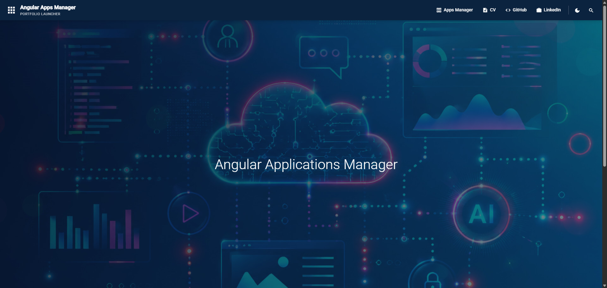
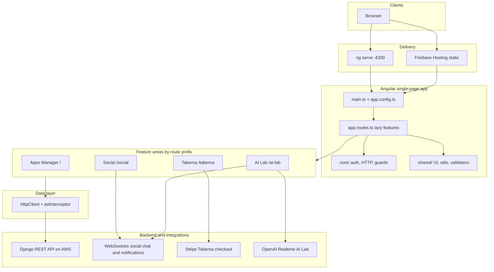
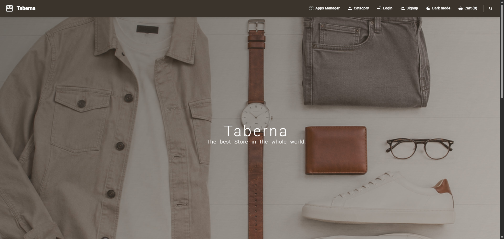

# Angular Applications Manager

Feature-parity Angular rewrite of the [Vue Applications Manager](https://github.com/karnaukh-webdev/test-applications-manager-vue) monorepo SPA. Four sub-applications share one Django REST API backend.

### Live Demo on Firebase: <https://angular.karnaukh-webdev.com>



## Table of Contents

- [Overview](#overview)
- [Tech Stack](#tech-stack)
- [Architecture](#architecture)
- [Sub-Applications](#sub-applications)
- [Project Structure](#project-structure)
- [Prerequisites](#prerequisites)
- [Getting Started](#getting-started)
- [Environment Variables](#environment-variables)
- [CI/CD Pipeline](#cicd-pipeline)
- [Available Scripts](#available-scripts)
- [Backend](#backend)
- [Development Plan](#development-plan)

## Overview

The application is a portfolio launcher and multi-app shell: **Apps Manager**, **Taberna eCommerce**, **Social Network**, and **AI Lab**. Each area has its own layout, routes, and signal-based stores while sharing core auth, HTTP interceptors, and Angular Material UI.

The frontend talks to the same **Django REST API** on AWS as the Vue app. Production builds are deployed to **Firebase Hosting** via GitHub Actions.

## Tech Stack

| Technology                  | Purpose                                          |
| --------------------------- | ------------------------------------------------ |
| Angular 22                  | Frontend framework (standalone components)       |
| Angular Router              | Client-side routing with lazy-loaded features    |
| Angular Material            | UI components                                    |
| Signals + injectable stores | Feature state (`data-access/*.store.ts`)         |
| HttpClient + interceptors   | API requests, JWT refresh                        |
| Reactive Forms              | Form validation (checkout, auth)                 |
| CryptoJS                    | Encrypted social profile cache in `localStorage` |
| `@stripe/stripe-js`         | Taberna checkout (charge mode)                   |
| Vitest                      | Unit tests via `ng test`                         |
| `@vitest/coverage-v8`       | Coverage reports in CI                           |
| Firebase Hosting            | Static SPA deploy                                |
| GitHub Actions              | Lint, test, build, deploy                        |

## Architecture



| Layer                                       | Role                                                                                      |
| ------------------------------------------- | ----------------------------------------------------------------------------------------- |
| **Bootstrap** (`main.ts`, `app.config.ts`)  | `provideRouter`, `provideHttpClient` with JWT interceptor, Material theme.                |
| **Shell** (`app.component.ts`)              | Global snackbar + `<router-outlet>`.                                                      |
| **Router** (`app.routes.ts`, `*.routes.ts`) | Lazy `loadChildren` / `loadComponent`; `authGuard` + `data.authJWT` for protected routes. |
| **Core** (`src/app/core/`)                  | `AuthService`, `JwtInterceptor`, `AuthGuard`, `AlertService`, `LoadingService`.           |
| **Features** (`src/app/features/`)          | Per-app layouts, pages, `*.api.service.ts`, `*.store.ts`.                                 |
| **Shared** (`src/app/shared/`)              | Auth forms, empty states, skeletons, `ThemeService`, validators.                          |
| **CI/CD** (`.github/workflows/`)            | `ci.yml` on PR; `firebase-hosting-merge.yml` on `main` → coverage, build, deploy.         |

**Routing at a glance**

- `/` — Apps Manager home; `/apps_manager/search` — catalog search.
- `/taberna`, `/taberna-store/...`, `/taberna/cart`, checkout and account routes — e-commerce.
- `/social/...` — feed, profiles, chat, notifications.
- `/ai-lab/...` — AI chat, image/voice generators, realtime chat.

## Sub-Applications

### 1. Apps Manager (Home)

Portfolio launcher — card grid of projects with search.

- **Route:** `/`
- **Layout:** `MainAppsManagerLayoutComponent`
- **Docs:** [src/app/features/apps-manager/README.md](src/app/features/apps-manager/README.md)


### 2. Taberna eCommerce

Product catalog, cart, Stripe checkout, user dashboard.

- **Route:** `/taberna`
- **Live Demo:** <https://angular.karnaukh-webdev.com/taberna>
- **Layout:** `MainTabernaLayoutComponent`
- **Stores:** `TabernaProductStore`, `TabernaCartStore`, `TabernaOrdersStore`, `TabernaProfileStore`
- **Docs:** [src/app/features/taberna/README.md](src/app/features/taberna/README.md)
- **Backend:** [Taberna Backend](https://karnaukh-webdev.com/category/django/taberna-drf-ecommerce/)



### 3. Social Network DRF

Posts feed, profiles, friends, real-time chat and notifications.

- **Route:** `/social/home`
- **Live Demo:** <https://angular.karnaukh-webdev.com/social/home>
- **Layout:** `MainSocialLayoutComponent`
- **Stores:** `SocialPostsStore`, `SocialProfileStore`, `SocialChatStore`, `SocialNotificationsStore`
- **Docs:** [src/app/features/social/README.md](src/app/features/social/README.md)
- **Backend:** [Social Network Backend](https://karnaukh-webdev.com/category/django/social-network-drf/)


### 4. AI Lab

Text chat, image/voice generation, OpenAI Realtime WebSocket chat.

- **Route:** `/ai-lab`
- **Live Demo:** <https://angular.karnaukh-webdev.com/ai-lab>
- **Layout:** `MainAiLabLayoutComponent`
- **Store:** `AiLabStore`
- **Docs:** [src/app/features/ai-lab/README.md](src/app/features/ai-lab/README.md)
- **Backend:** [AI Lab Backend](https://karnaukh-webdev.com/category/django/ai-lab-back-end/)


## Project Structure

```
src/
├── app/
│   ├── core/                       # Auth, HTTP, guards, alert, loading
│   ├── shared/                     # UI, utils, validators, ThemeService
│   └── features/                   # README + screenshot at feature root
│       ├── apps-manager/
│       ├── taberna/
│       ├── social/
│       └── ai-lab/
├── environments/                   # environment.ts / environment.prod.ts
├── styles.scss                     # Global Material theme + app tokens
└── main.ts
public/                             # Static images (hero backgrounds)
firebase.json                       # SPA rewrites → dist/angular-test-manager/browser
.firebaserc                         # Firebase project: angular-test-manager
scripts/write-prod-environment.mjs  # CI: secrets → environment.prod.ts
```

## Prerequisites

- **Node.js** 24.x (see `.nvmrc`)
- **npm** 11+
- Django REST API reachable at `remoteHost` (local or AWS)

## Getting Started

### 1. Clone the repository

```bash
git clone <your-angular-repo-url>
cd angular-test-manager
```

### 2. Install dependencies

```bash
npm install
```

### 3. Configure environment

```bash
cp .env.example .env
```

Edit `src/environments/environment.ts` for local API URL and keys (or use values from `.env` via your workflow).

### 4. Start the development server

```bash
npm start
```

Open [http://localhost:4200](http://localhost:4200).

### Makefile (optional)

```bash
make run        # npm start
make node       # nvm + global CLI tools
make update     # clean reinstall with ncu
```

## Environment Variables

| Variable (local `.env` / CI secret) | Angular `environment.*` | Description                                            |
| ----------------------------------- | ----------------------- | ------------------------------------------------------ |
| `REMOTE_HOST`                       | `remoteHost`            | Backend API base URL                                   |
| `ENCRYPTION_KEY`                    | `encryptionKey`         | CryptoJS key for social profile cache                  |
| `STRIPE_PUBLIC_KEY`                 | `stripePublicKey`       | Stripe publishable key (Taberna)                       |
| `STRIPE_ACTION_TYPE`                | `stripeActionType`      | `session` or `charge` (CI variable, default `session`) |
| `NODE_VERSION`                      | `.nvmrc`                | Node version for local/CI                              |

Production build injects secrets via `scripts/write-prod-environment.mjs` in the deploy workflow.

## CI/CD Pipeline

| Workflow                     | Trigger                | Steps                                                             |
| ---------------------------- | ---------------------- | ----------------------------------------------------------------- |
| `ci.yml`                     | pull request to `main` | `npm ci` → lint → test → build                                    |
| `firebase-hosting-merge.yml` | push to `main`         | lint → `test:coverage` → write prod env → build → Firebase deploy |

**GitHub Secrets:** `REMOTE_HOST`, `ENCRYPTION_KEY`, `STRIPE_PUBLIC_KEY`, `FIREBASE_SERVICE_ACCOUNT`.

**Firebase project:** `angular-test-manager`.

## Available Scripts

| Command                 | Description                                            |
| ----------------------- | ------------------------------------------------------ |
| `npm start`             | Dev server on port 4200                                |
| `npm run build`         | Production build → `dist/angular-test-manager/browser` |
| `npm run test`          | Unit tests (watch)                                     |
| `npm run test:run`      | Unit tests once                                        |
| `npm run test:coverage` | Tests with coverage (CI)                               |
| `npm run lint`          | ESLint                                                 |

## Backend

The Django REST Framework backend is hosted on AWS and powers all sub-applications.

- **Taberna:** [karnaukh-webdev.com/category/django/taberna-drf-ecommerce/](https://karnaukh-webdev.com/category/django/taberna-drf-ecommerce/)
- **Social Network:** [karnaukh-webdev.com/category/django/social-network-drf/](https://karnaukh-webdev.com/category/django/social-network-drf/)
- **AI Lab:** [karnaukh-webdev.com/category/django/ai-lab-back-end/](https://karnaukh-webdev.com/category/django/ai-lab-back-end/)

## Development Plan

Full phase-by-phase porting guide: [docs/angular-frontend-development-plan.md](docs/angular-frontend-development-plan.md).

Vue reference implementation: [test-applications-manager-vue](https://github.com/karnaukh-webdev/test-applications-manager-vue).

### test
