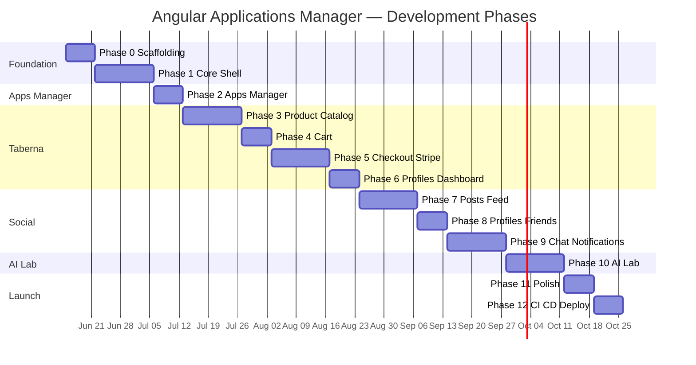

# Angular Applications Manager — Frontend Development Plan

## Full Angular rewrite of the Vue Applications Manager monorepo SPA

---

## 0. Context & Starting Point

### Existing Vue Frontend Summary

The current application (`test-applications-manager-vue`) is a **Vue 3.5** single-page app with **four embedded sub-applications** sharing one Django REST API backend:

| Sub-app | Route prefix | Purpose |
|---------|--------------|---------|
| **Apps Manager** | `/`, `/apps_manager/*` | Portfolio launcher — card grid of projects |
| **Taberna eCommerce** | `/taberna`, `/taberna-store/*` | Product catalog, cart, Stripe checkout, user dashboard |
| **Social Network DRF** | `/social/*` | Posts feed, profiles, friends, chat, notifications |
| **AI Lab** | `/ai-lab/*` | AI chat, image/voice generation, OpenAI Realtime WebSocket |

**Current stack:** Vue 3, Vue Router 5, Vuex 4, Vuetify 4, Axios, Vuelidate, CryptoJS, Vite 8, Vitest, Firebase Hosting.

**Reference implementation:** [README.md](../../README.md), per-app READMEs under `src/apps/*/README.md`, and completed refactor index [docs/frontend-refactor/README.md](../frontend-refactor/README.md).

### What This Plan Covers

A **feature-parity Angular rewrite** in a **new repository** (recommended name: `test-applications-manager-angular`) that:

- Uses the **same Django REST API** on AWS — **no backend changes**
- Preserves **all user-visible URLs** (`/taberna/cart`, `/social/chat`, etc.)
- Replicates **all four sub-applications** with equivalent UX
- Deploys to **Firebase Hosting** (same or parallel project)
- Matches Vue app behaviour for JWT auth, cart merge on login, Stripe modes, WebSockets

### Vue → Angular Reference Mapping

| Vue (current) | Angular (target) |
|---------------|------------------|
| Vue SFC (`.vue`) | Standalone components (`.component.ts` + `.html` + `.scss`) |
| Vue Router + `meta.layout` | Angular Router + nested routes + layout components |
| Vuex namespaced modules | NgRx feature stores **or** Signal-based services + `computed()` |
| Axios + interceptors | `HttpClient` + `HttpInterceptor` |
| Vuelidate | Reactive Forms + custom validators / `@angular/forms` validators |
| Vuetify (`v-app`, `v-btn`, …) | Angular Material + CDK |
| `import.meta.env.VITE_*` | `environment.ts` / `environment.prod.ts` |
| Vitest + `@vue/test-utils` | Jest + `TestBed` (or Vitest + `@analogjs/vitest-angular`) |
| Composables | Injectable services + signals |
| Dynamic layout in `App.vue` | Parent layout routes with `<router-outlet>` |

### Backend Dependency (all phases)

> **No new backend work is required.** The Django REST API, WebSocket endpoints, and Stripe webhooks already exist and power the Vue app today. Each Angular phase lists which **existing** API surface must be reachable for integration testing.

**Backend docs:**

- [Taberna Backend](https://karnaukh-webdev.com/category/django/taberna-drf-ecommerce/)
- [Social Network Backend](https://karnaukh-webdev.com/category/django/social-network-drf/)
- [AI Lab Backend](https://karnaukh-webdev.com/category/django/ai-lab-back-end/)

---

## 1. Project Structure

### 1.1 Recommended Repository Layout

```
test-applications-manager-angular/
├── angular.json
├── package.json
├── firebase.json
├── .github/workflows/firebase-hosting-merge.yml
├── .env.example
├── Dockerfile
├── docker-compose.yml
├── Makefile
├── README.md
├── docs/
│   └── angular-frontend-development-plan.md   # copy or link to this plan
└── src/
    ├── index.html
    ├── main.ts
    ├── styles.scss                            # global Material theme + tokens
    ├── environments/
    │   ├── environment.ts
    │   └── environment.prod.ts
    └── app/
        ├── app.component.ts                   # root shell (mat-app layout)
        ├── app.config.ts                      # providers, interceptors, store
        ├── app.routes.ts                      # merges feature route arrays
        │
        ├── core/                              # singleton services, guards, interceptors
        │   ├── auth/
        │   │   ├── auth.service.ts
        │   │   ├── auth-jwt-api.service.ts
        │   │   ├── auth-token-api.service.ts
        │   │   ├── auth.guard.ts
        │   │   └── auth.models.ts
        │   ├── http/
        │   │   ├── jwt.interceptor.ts
        │   │   └── api-base-url.token.ts
        │   ├── alert/
        │   │   └── alert.service.ts
        │   └── loading/
        │       └── loading.service.ts
        │
        ├── shared/
        │   ├── ui/
        │   │   ├── app-message/               # global toast/snackbar
        │   │   ├── auth-login-form/
        │   │   └── auth-signup-form/
        │   ├── utils/
        │   │   ├── crypto.utils.ts
        │   │   ├── domain.utils.ts
        │   │   └── error.utils.ts
        │   └── validators/
        │       └── auth.validators.ts
        │
        └── features/                          # mirrors src/apps/* in Vue
            ├── apps-manager/
            │   ├── apps-manager.routes.ts
            │   ├── layouts/main-apps-manager-layout/
            │   ├── pages/                     # Home, Search, NotFound
            │   ├── components/                # Navbar, Footer, AppCard
            │   └── data-access/               # vueApps API service + store
            │
            ├── taberna/
            │   ├── taberna.routes.ts
            │   ├── layouts/main-taberna-layout/
            │   ├── product/                   # catalog, search, detail
            │   ├── cart/
            │   ├── orders/                    # checkout, success, failed
            │   └── profiles/                    # login, signup, dashboard
            │
            ├── social/
            │   ├── social.routes.ts
            │   ├── layouts/main-social-layout/
            │   ├── posts/
            │   ├── profiles/
            │   ├── chat/
            │   └── notifications/
            │
            └── ai-lab/
                ├── ai-lab.routes.ts
                ├── layouts/main-ai-lab-layout/
                ├── pages/
                ├── components/
                └── data-access/
```

### 1.2 Angular Module Strategy

Use **standalone components** and **lazy-loaded feature routes** (Angular 17+ style). Avoid NgModules except where a third-party library requires them.

| Feature area | Lazy route prefix | Layout component |
|--------------|-------------------|------------------|
| Apps Manager | `''` (root) | `MainAppsManagerLayoutComponent` |
| Taberna | `taberna`, `taberna-store` | `MainTabernaLayoutComponent` |
| Social | `social` | `MainSocialLayoutComponent` |
| AI Lab | `ai-lab` | `MainAiLabLayoutComponent` |

### 1.3 Integration Points (Angular bootstrap)

| Integration Point | Action |
|-------------------|--------|
| `app.config.ts` | Register `provideHttpClient(withInterceptors([jwtInterceptor]))`, `provideRouter(routes)`, Material theme, NgRx store (if used) |
| `environment.ts` | Map `remoteHost`, `encryptionKey`, `stripePublicKey`, `stripeActionType` from Vue `VITE_*` vars |
| `app.routes.ts` | Spread route arrays from each feature's `*.routes.ts` |
| `Main*LayoutComponent` | Host navbar, footer, `<router-outlet>`, app-specific init (e.g. notification WebSocket on Social layout) |
| `firebase.json` | SPA rewrite rules — same as Vue (`**` → `index.html`) |

---

## 2. Route Configuration

### 2.1 Route Parity Matrix (must match Vue exactly)

#### Apps Manager

| Path | Component | Auth | Layout |
|------|-----------|------|--------|
| `/` | HomePage | No | `mainAppsManager` |
| `/apps_manager/search` | SearchPage | No | `mainAppsManager` |
| `/**` (catch-all) | NotFoundPage | No | `mainAppsManager` |

#### Taberna

| Path | Component | Auth (`authJWT`) | Layout |
|------|-----------|------------------|--------|
| `/taberna` | ProductHomePage | No | `mainTaberna` |
| `/taberna/signup` | SignupPage | No | `mainTaberna` |
| `/taberna/login` | LoginPage | No | `mainTaberna` |
| `/taberna/dashboard` | DashboardPage | **Yes** | `mainTaberna` |
| `/taberna-store/category/:category_slug` | CategoryDetailPage | No | `mainTaberna` |
| `/taberna-store/category/:category_slug/:product_slug` | ProductDetailPage | No | `mainTaberna` |
| `/taberna/search` | SearchPage | No | `mainTaberna` |
| `/taberna/cart` | CartPage | No | `mainTaberna` |
| `/taberna/cart/checkout` | CheckoutPage | **Yes** | `mainTaberna` |
| `/taberna/cart/success` | SuccessPage | No | `mainTaberna` |
| `/taberna/cart/failed` | FailedPage | No | `mainTaberna` |

#### Social

| Path | Component | Auth | Layout |
|------|-----------|------|--------|
| `/social/home` | FeedHomePage | No | `mainSocial` |
| `/social/profile/edit` | EditProfilePage | **Yes** | `mainSocial` |
| `/social/profile/:slug` | ProfilePage | No | `mainSocial` |
| `/social/profile/:slug/friends` | FriendsPage | **Yes** | `mainSocial` |
| `/social/:id` | PostDetailPage | No | `mainSocial` |
| `/social/trends/:id` | TrendPage | No | `mainSocial` |
| `/social/chat` | ChatPage | **Yes** | `mainSocial` |
| `/social/notifications` | NotificationsPage | **Yes** | `mainSocial` |
| `/social/search` | SearchPage | No | `mainSocial` |
| `/social/signup` | SignupPage | No | `mainSocial` |
| `/social/login` | LoginPage | No | `mainSocial` |
| `/social/edit/password` | EditPasswordPage | **Yes** | `mainSocial` |

#### AI Lab

| Path | Component | Layout |
|------|-----------|--------|
| `/ai-lab` | AiHomePage (Funny Chat) | `mainAILab` |
| `/ai-lab/image-generator` | ImageGeneratorPage | `mainAILab` |
| `/ai-lab/voice-generator` | VoiceGeneratorPage | `mainAILab` |
| `/ai-lab/realtime-chat` | RealtimeChatPage | `mainAILab` |

### 2.2 Route Data & Guards

Mirror Vue `meta` flags using Angular `data` and `canActivate`:

```typescript
// Example route record
{
  path: 'taberna/cart/checkout',
  component: CheckoutPageComponent,
  canActivate: [authGuard],
  data: { layout: 'mainTaberna', authJWT: true },
}
```

| Guard | Logic (same as Vue `guards.js`) |
|-------|----------------------------------|
| `authGuard` | If `data.authJWT === true` and no valid access token → redirect to login |
| Taberna login redirect | `/taberna/login?redirect=<encoded-path>&message=auth` |
| Social login redirect | `/social/login?message=auth` |
| Default (other apps) | `/` |

### 2.3 Layout Routing Pattern

Replace Vue's dynamic `<component :is="layoutComponent">` with nested routes:

```typescript
{
  path: '',
  component: MainTabernaLayoutComponent,
  children: [
    { path: 'taberna', component: ProductHomePageComponent },
    // ...
  ],
}
```

Each `Main*LayoutComponent` template: navbar + `<router-outlet>` + footer + global `AppMessageComponent`.

---

## 3. State Management

### 3.1 Vuex → Angular Mapping

| Vue Vuex module | Angular equivalent | Scope |
|-----------------|-------------------|-------|
| `authJWT` | `AuthService` + optional `auth` NgRx feature | Core |
| `authToken` | `AuthTokenService` | Core (signup registration) |
| `alert` | `AlertService` (MatSnackBar wrapper) | Core |
| Root `isLoading` | `LoadingService` signal | Core |
| `tabernaCartData` | `TabernaCartStore` (service or NgRx) | Taberna |
| `tabernaOrdersData` | `TabernaOrdersStore` | Taberna |
| `tabernaProductData` | `TabernaProductStore` | Taberna |
| `tabernaProfileData` | `TabernaProfileStore` | Taberna |
| `socialPostData` | `SocialPostsStore` | Social |
| `socialProfileData` | `SocialProfileStore` | Social |
| `socialChatData` | `SocialChatStore` + WebSocket service | Social |
| `socialNotificationData` | `SocialNotificationStore` + WebSocket service | Social |
| `aiLabChatData` | `AiLabStore` + Realtime WebSocket service | AI Lab |

### 3.2 Recommended Approach

| Option | When to use |
|--------|-------------|
| **Signal-based injectable stores** (`signal()`, `computed()`, `patchState` pattern) | Default for all feature stores — simpler, aligns with modern Angular |
| **NgRx ComponentStore** | Per-feature complex async flows (checkout, infinite scroll feeds) |
| **Full NgRx Store** | Only if team prefers strict Redux DevTools parity with Vuex |

**Recommendation:** Start with **signal stores in `data-access/` folders** per domain. Migrate to NgRx ComponentStore only where async orchestration becomes painful (Social feed pagination + WebSocket, Taberna checkout).

### 3.3 Persistence Rules (parity with Vue)

| Data | Storage | Notes |
|------|---------|-------|
| JWT access/refresh | `localStorage` keys `access`, `refresh` | Same keys for cross-app compatibility during migration |
| Active app | `localStorage` key `active_app` | Values: `taberna`, `social`, etc. |
| Anonymous cart ID | `localStorage` `cartId` | Taberna cart merge on login |
| Social user profile | `localStorage` encrypted via CryptoJS | Key from `environment.encryptionKey` |
| Checkout form state | In-memory only | Do not persist billing data |

---

## 4. HTTP & Authentication Layer

### 4.1 HttpClient Interceptor (replaces `axiosInterceptors.js`)

| Request interceptor | Attach `Authorization: Bearer <accessToken>` from `AuthService` |
| Response interceptor | On 401 (not refresh/obtain URL, not retried): call `AuthService.refreshToken()`, retry original request once |

### 4.2 JWT Endpoints per App

| App | Obtain URL |
|-----|------------|
| Default | `POST /api/v1/token/` |
| Taberna | `POST /taberna-profiles/api/v1/token/` |
| Social | `POST /api/social-profiles/api/v1/token/` |
| Refresh (all) | `POST /api/v1/token/refresh/` |

### 4.3 Registration Endpoints

| App | Register URL |
|-----|--------------|
| Taberna | `POST /taberna-profiles/api/register/` |
| Social | `POST /api/social-profiles/register/` |
| Default | `POST /api/v1/authusers/` |

### 4.4 Environment Variables

| Vue (`VITE_*`) | Angular (`environment.*`) | Purpose |
|----------------|---------------------------|---------|
| `VITE_REMOTE_HOST` | `remoteHost` | API base URL |
| `VITE_ENCRIPTION_KEY` | `encryptionKey` | CryptoJS AES for social profile |
| `VITE_STRIPE_PUBLIC_KEY` | `stripePublicKey` | Stripe.js publishable key |
| `VITE_STRIPE_ACTION_TYPE` | `stripeActionType` | `session` or `charge` |
| `NODE_VERSION` | `.nvmrc` / CI config | Node 22.x |

---

## 5. API Service Layer

Pure HTTP services in `data-access/*.api.service.ts` — no components, no store logic. Mirror Vue `src/apps/*/api/*.js`.

### 5.1 Apps Manager

| Method | Endpoint | Service method |
|--------|----------|----------------|
| GET | `/api/v1/vue-apps/` | `fetchApps()` |
| POST | `/api/v1/vue-apps/search/` | `searchApps(query)` |

### 5.2 Taberna — Products

| Method | Endpoint |
|--------|----------|
| GET | `/taberna-store/api/v1/latest-products/` |
| GET | `/taberna-store/api/v1/products/:category_slug/` |
| GET | `/taberna-store/api/v1/products/:category/:product` |
| GET | `/taberna-store/api/v1/product-categories/` |
| POST | `/taberna-store/api/v1/products/search/` |

### 5.3 Taberna — Cart

| Method | Endpoint |
|--------|----------|
| GET | `/taberna-cart/api/cart/` |
| POST | `/taberna-cart/api/add-to-cart/:productId/` |
| DELETE | `/taberna-cart/api/cart-remove/:productId/:cartItemId/` |
| DELETE | `/taberna-cart/api/cart-item-remove/:productId/:cartItemId/` |

### 5.4 Taberna — Orders & Profiles

| Method | Endpoint |
|--------|----------|
| POST | `/taberna-orders/api/v1/place_order_stripe_session/` |
| POST | `/taberna-orders/api/v1/place_order_stripe_charge/` |
| POST | `/taberna-orders/api/v1/order_payment_success/` |
| POST | `/taberna-orders/api/v1/order_payment_failed/` |
| GET | `/taberna-profiles/api/v1/orders/` |

### 5.5 Social — Posts

| Method | Endpoint |
|--------|----------|
| GET | `/api/social-posts/` |
| POST | `/api/social-posts/create/` |
| GET | `/api/social-posts/:id/` |
| POST | `/api/social-posts/:id/comment/` |
| POST | `/api/social-posts/:id/like/` |
| POST | `/api/social-posts/:id/report/` |
| DELETE | `/api/social-posts/:id/delete/` |
| GET | `/api/social-posts/profile/:slug/` |
| POST | `/api/social-posts/search/` |
| GET | `/api/social-posts/trends/` |
| GET | `/api/social-posts/?trend=:id` |

### 5.6 Social — Profiles

| Method | Endpoint |
|--------|----------|
| GET | `/api/social-profiles/me/` |
| POST | `/api/social-profiles/editprofile/` |
| POST | `/api/social-profiles/editpassword/` |
| GET | `/api/social-profiles/friends/:slug/` |
| POST | `/api/social-profiles/friends/:slug/request/` |
| POST | `/api/social-profiles/friends/:slug/:status/` |
| GET | `/api/social-profiles/friends/suggested/` |

### 5.7 Social — Chat & Notifications

| Method | Endpoint |
|--------|----------|
| GET | `/api/social-chat/` |
| GET | `/api/social-chat/:id/` |
| POST | `/api/social-chat/:id/send/` |
| GET | `/api/social-chat/:slug/get-or-create/` |
| GET | `/api/social-notifications/` |
| POST | `/api/social-notifications/read/:id/` |

### 5.8 AI Lab

| Method | Endpoint |
|--------|----------|
| POST | `/ai-lab/` |
| POST | `/ai-lab/image-generator/` |
| POST | `/ai-lab/voice-generator/` |
| POST | `/ai-lab/download-image/` |
| POST | `/ai-lab/upload-vision-images/` |
| DELETE | `/ai-lab/delete-vision-image/` |
| POST | `/ai-lab/realtime-token/` |

> Full request/response contracts: see Vue per-app READMEs in `src/apps/*/README.md`.

---

## 6. WebSocket Integration

### 6.1 Social Chat WebSocket

| Item | Value |
|------|-------|
| URL | `ws(s)://<remoteHost>/ws/social-chat/<conversationId>/<userId>/` |
| Connect | When user selects a conversation in Chat page |
| Disconnect | On conversation switch or leave Chat route |
| Service | `SocialChatWebSocketService` wrapping native `WebSocket` or RxJS `webSocket` |

### 6.2 Social Notification WebSocket

| Item | Value |
|------|-------|
| URL | `ws(s)://<remoteHost>/ws/notification/<userId>/` |
| Connect | On login + `MainSocialLayout` init when authenticated |
| On message | Re-fetch notifications list, update unread badge |
| Disconnect | On logout |

### 6.3 AI Lab OpenAI Realtime WebSocket

| Step | Action |
|------|--------|
| 1 | `POST /ai-lab/realtime-token/` → ephemeral key |
| 2 | Open `wss://api.openai.com/v1/realtime` with subprotocol headers |
| 3 | Send `conversation.item.create` + `response.create` on user message |
| 4 | Handle `response.done` → append transcript to chat history |
| Init | `MainAiLabLayoutComponent.ngOnInit` (mirrors Vue layout mount) |

---

## 7. Stripe Integration (Taberna)

Same dual-mode behaviour as Vue (`environment.stripeActionType`):

### Session Mode (`session`)

1. Submit billing form → `POST /taberna-orders/api/v1/place_order_stripe_session/`
2. Redirect browser to Stripe `checkout_url`
3. Return to `/taberna/cart/success?session_id=...` or `/failed?session_id=...`
4. Confirm via `order_payment_success` / `order_payment_failed`

### Charge Mode (`charge`)

1. Load `@stripe/stripe-js`, mount Stripe Elements on checkout page
2. `stripe.createToken()` client-side
3. `POST /taberna-orders/api/v1/place_order_stripe_charge/` with token + billing data
4. Navigate to success/failed page

**Angular service:** `StripeCheckoutService` — lazy-loads Stripe.js, encapsulates mode branching.

---

## 8. UI & Styling

### 8.0 UI foundation (mandatory)

**Angular Material is the only UI library for this project.** When porting screens from the Vue app (Vuetify), do **not** recreate Vuetify markup or copy Vuetify-specific CSS. Instead, map each Vuetify building block to the **closest Angular Material equivalent** and use **default Material appearance** (theme tokens, stock component layout, no custom SCSS unless unavoidable).

| Rule | Meaning |
|------|---------|
| **Component-for-component** | Vuetify button → `mat-button`; Vuetify card → `mat-card`; Vuetify grid → Material layout (`mat-grid-list`, flex, or CDK) — same role, Material API |
| **No Vuetify visual clone** | Do not hard-code Vuetify colors (`#ff4800`, `manager` theme bar, parallax overlays, etc.) to “match pixels”; rely on Material theme |
| **Minimal custom CSS** | Prefer zero feature-level `.scss`; global theme lives in `src/styles.scss` only |
| **Reference** | Vue file = **behaviour and structure**; Angular file = **Material components** that fulfil the same UX |

**Example (Apps Manager):** Vue `v-app-bar` + `v-btn` + `v-card` → Angular `mat-toolbar` + `mat-button` + `mat-card` with default styling.

Full mapping table: Section 8.1.

### 8.1 Component Library

| Vue (Vuetify) | Angular Material equivalent |
|---------------|------------------------------|
| `v-app` | `mat-sidenav-container` or root flex layout |
| `v-app-bar` / `v-navigation-drawer` | `mat-toolbar` + `mat-sidenav` |
| `v-btn`, `v-icon` | `mat-button` / `mat-icon-button`, `mat-icon` |
| `v-card`, `v-card-title`, `v-card-actions` | `mat-card`, `mat-card-header`, `mat-card-actions` |
| `v-container`, `v-row`, `v-col` | `mat-grid-list` / flex layout / `@angular/cdk/layout` (same layout role) |
| `v-img` | `img` with `mat-card-image` or `mat-card` media slot |
| `v-parallax` | `mat-card` + `mat-card-image` (or static hero image — no custom parallax CSS) |
| `v-dialog` | `MatDialog` + `mat-dialog-title` / `mat-dialog-content` / `mat-dialog-actions` |
| `v-menu`, `v-list`, `v-list-item` | `mat-menu`, `mat-nav-list`, `mat-list-item` |
| `v-form` | Reactive `form` + `mat-form-field` |
| `v-data-table` | `mat-table` |
| `v-text-field`, `v-select` | `mat-form-field` + `input` / `mat-select` |
| `v-divider` | `mat-divider` |
| `v-snackbar` (AppMessage) | `MatSnackBar` via `AlertService` |
| `v-progress-linear`, `v-progress-circular` | `mat-progress-bar`, `mat-progress-spinner` |
| `v-skeleton-loader` | `mat-progress-bar` or placeholder `mat-card` |
| Theme toggle | Material light/dark via `ThemeService` + `color-scheme` in `styles.scss` |

### 8.2 Shared Auth Forms

Port `AuthLoginForm` and `AuthSignupForm` from `src/shared/auth/components/` as reusable Angular components with Reactive Forms validators matching Vuelidate rules.

### 8.3 Responsive & Theme

- Light/dark toggle in each app's navbar (persist preference in `localStorage`)
- Mobile: Material `mat-sidenav` where Vue used `v-navigation-drawer`
- Roboto + Material Icons (Material Design defaults — no Vuetify MDI dependency)

---

## 9. Development Phases

> **How to read:** Each phase lists deliverables, tasks, and backend/API dependencies. UI scaffolding can start with mock data; integration testing requires the existing Django API. Phases are ordered by dependency and increasing complexity.

---

### Phase 0: Repository Scaffolding & Tooling (Week 1)

**Goal:** New Angular workspace, CI skeleton, Docker dev environment, environment config.

**Backend dependency:** None.

**Tasks:**

1. Create Angular 19+ project with standalone components, SCSS, routing
2. Add Angular Material, configure light/dark theme
3. Set up path aliases (`@core`, `@shared`, `@features/*`)
4. Create `environment.ts` / `.env.example` mirroring Vue variables
5. Add ESLint, Prettier, Husky (optional)
6. Copy/adapt `Dockerfile`, `docker-compose.yml`, `Makefile` from Vue repo
7. Create GitHub Actions workflow skeleton (lint + test + build)
8. Add `firebase.json` SPA rewrites
9. Document local setup in `README.md`

**Deliverables:**

- `ng serve` runs on port 4200 (or 5173 for parity)
- Empty shell with Material theme
- CI pipeline runs build (no deploy yet)

---

### Phase 1: Core Shell — Auth, HTTP, Layouts, Routing (Weeks 1–2)

**Goal:** Shared infrastructure equivalent to Vue `main.js`, `App.vue`, `shared/router`, `shared/auth`, `http/axiosInterceptors`.

**Backend dependency:** JWT obtain/refresh endpoints (already live).

| Endpoint | Purpose |
|----------|---------|
| `POST /api/v1/token/` | Default login |
| `POST /taberna-profiles/api/v1/token/` | Taberna login |
| `POST /api/social-profiles/api/v1/token/` | Social login |
| `POST /api/v1/token/refresh/` | Token refresh |

**Can start immediately (no backend):**

- `AuthService`, `AuthGuard`, login redirect helpers
- `JwtInterceptor` with 401 refresh logic
- `AlertService` + `AppMessageComponent`
- `LoadingService` global spinner
- Four empty layout components with placeholder navbar/footer
- Route tree with all paths wired to placeholder pages

**Needs backend to test:**

- Full login/logout/refresh cycle per app

**Tasks:**

1. Implement `AuthService` (login, logout, refresh, `isAuthenticated`, token storage)
2. Implement `JwtInterceptor` (mirror `axiosInterceptors.js` behaviour)
3. Implement `AuthGuard` (mirror `guards.js` + `getLoginRoute`)
4. Implement `AuthLoginFormComponent`, `AuthSignupFormComponent` with validators
5. Implement `AppMessageComponent` + `AlertService`
6. Create four layout shells: Apps Manager, Taberna, Social, AI Lab
7. Wire full route table (Section 2.1) to stub page components
8. Root `AppComponent` with global message + `<router-outlet>`
9. Unit tests: interceptor 401 retry, guard redirects, auth service token storage

**Deliverables:**

- Navigable app skeleton — all URLs resolve to stub pages inside correct layouts
- JWT login works against Taberna and Social backends
- Global error toasts display API errors

---

### Phase 2: Apps Manager (Week 2)

**Goal:** Simplest sub-app — portfolio launcher. Validates end-to-end pattern before Taberna.

**Backend dependency:**

| Endpoint | Purpose |
|----------|---------|
| `GET /api/v1/vue-apps/` | Home page card grid |
| `POST /api/v1/vue-apps/search/` | Search page |

**Can start immediately:**

- `AppCardComponent`, navbar, footer, home/search page layouts with mock data

**Tasks:**

1. `VueAppsApiService` + `AppsManagerStore`
2. `HomePageComponent` — fetch and render app cards
3. `AppCardComponent` — image, description, live demo + details buttons
4. `SearchPageComponent` — search form + results
5. `NotFoundPageComponent` — catch-all route
6. `MainAppsManagerLayoutComponent` — navbar with links to other sub-apps
7. Unit tests for API service and store

**Deliverables:**

- `/` and `/apps_manager/search` fully functional
- Parity with Vue Apps Manager screenshots

---

### Phase 3: Taberna — Product Catalog (Weeks 3–4)

**Goal:** Browse products, categories, search, product detail with variations.

**Backend dependency:** All Taberna Store API endpoints (Section 5.2).

**Can start immediately:**

- `ProductCardComponent`, category dropdown UI, product detail gallery layout with mocks

**Tasks:**

1. `TabernaProductApiService` + `TabernaProductStore`
2. `ProductHomePageComponent` — latest products grid
3. `CategoryDetailPageComponent` — products by category slug
4. `ProductDetailPageComponent` — gallery, color/size selectors, add-to-cart button
5. `SearchPageComponent` — navbar search dialog → results page
6. `MainTabernaLayoutComponent` — category dropdown, search, theme toggle, cart badge placeholder
7. Unit tests for product store actions

**Deliverables:**

- Full catalog browsing without cart/checkout
- Product detail with variation selection UI

---

### Phase 4: Taberna — Cart (Week 5)

**Goal:** Anonymous + authenticated cart, quantity controls, cart persistence.

**Backend dependency:** Taberna Cart API (Section 5.3).

**Tasks:**

1. `TabernaCartApiService` + `TabernaCartStore`
2. `CartPageComponent` — item table, totals, tax, grand total
3. `CartItemComponent` — increment/decrement/remove line
4. `cartId` localStorage persistence for guest users
5. Cart badge in Taberna navbar (live count)
6. Add-to-cart from product detail page
7. Unit tests for cart mutations

**Deliverables:**

- Guest cart persists across page reloads
- Cart badge updates on add/remove

---

### Phase 5: Taberna — Checkout, Stripe & Order Status (Weeks 6–7)

**Goal:** Billing form, dual Stripe modes, success/failed confirmation pages.

**Backend dependency:** Taberna Orders API (Section 5.4) + Stripe test keys.

**Can start immediately:**

- Checkout form UI with Reactive Forms validation
- Stripe Elements mount in charge mode (test publishable key)
- Success/failed page static UI

**Tasks:**

1. `TabernaOrdersApiService` + `TabernaOrdersStore`
2. `CheckoutPageComponent` — billing form (Vuelidate parity validators)
3. `StripeCheckoutService` — session redirect vs charge token flow
4. `SuccessPageComponent` / `FailedPageComponent` — session_id handling
5. Auth guard on checkout route
6. Integration test: session mode with Stripe test card (manual QA checklist)
7. Unit tests for order placement actions

**Deliverables:**

- End-to-end purchase flow in Stripe test mode (both session and charge)
- Checkout blocked for unauthenticated users

---

### Phase 6: Taberna — Profiles, Auth & Dashboard (Week 8)

**Goal:** Taberna login/signup, cart merge on login, order history dashboard.

**Backend dependency:**

| Endpoint | Purpose |
|----------|---------|
| `POST /taberna-profiles/api/register/` | Signup |
| `POST /taberna-profiles/api/v1/token/` | Login |
| `GET /taberna-profiles/api/v1/orders/` | Dashboard |

**Tasks:**

1. `TabernaProfileApiService` + `TabernaProfileStore`
2. `LoginPageComponent` / `SignupPageComponent` — reuse shared auth forms
3. Cart merge: pass `cartId` on login (mirror Vue login view)
4. `DashboardPageComponent` + `OrderSummaryComponent`
5. Logout clears tokens, refreshes anonymous cart
6. `checkActiveApp('taberna')` equivalent in Taberna layout

**Deliverables:**

- Register → login → dashboard with order history
- Guest cart merges into user cart on login

---

### Phase 7: Social — Posts, Feed & Search (Weeks 9–10)

**Goal:** Home feed, post detail, comments, likes, trends, search, create post.

**Backend dependency:** Social Posts API (Section 5.5).

**Can start immediately:**

- `SocialPostCardComponent`, `CreatePostFormComponent`, `TrendsComponent`, infinite scroll UI with mocks

**Tasks:**

1. `SocialPostsApiService` + `SocialPostsStore`
2. `FeedHomePageComponent` — infinite scroll feed + create post form
3. `PostDetailPageComponent` — single post + comments
4. `SearchPageComponent` — users + posts tabs, pagination
5. `TrendPageComponent` — posts filtered by hashtag
6. `SocialPostCardComponent` — like, comment, report/delete menu
7. `CommentItemComponent`, `TrendsComponent` sidebar widget
8. Unit tests for pagination and post actions

**Deliverables:**

- Public feed browsing, post creation (authenticated), search, trends

---

### Phase 8: Social — Profiles & Friends (Week 11)

**Goal:** User profiles, edit profile, friends, friend suggestions, password change.

**Backend dependency:** Social Profiles API (Section 5.6).

**Tasks:**

1. `SocialProfileApiService` + `SocialProfileStore`
2. `ProfilePageComponent` — profile card + user posts
3. `EditProfilePageComponent` — avatar upload (multipart), username/email
4. `FriendsPageComponent` — friends list, pending requests, accept/reject
5. `PeopleYouMayKnowComponent` — friend suggestions sidebar
6. `EditPasswordPageComponent`
7. CryptoJS encrypted profile persistence in localStorage
8. Login/signup pages reusing shared auth forms

**Deliverables:**

- Full profile management and friend system
- Encrypted local profile cache

---

### Phase 9: Social — Chat & Notifications (WebSocket) (Weeks 12–13)

**Goal:** Real-time chat, notification badge, notification list.

**Backend dependency:** Chat + Notifications REST API + both WebSocket endpoints (Section 6.1–6.2).

**Can start immediately:**

- Chat UI layout (conversation list + message pane) with mock messages
- Notifications list page UI

**Tasks:**

1. `SocialChatApiService` + `SocialChatStore`
2. `SocialChatWebSocketService` — connect/disconnect/message handler
3. `ChatPageComponent` — conversation list, active chat, send message
4. `SocialNotificationsApiService` + `SocialNotificationsStore`
5. `SocialNotificationWebSocketService` — connect on login, disconnect on logout
6. `NotificationsPageComponent` — mark as read
7. Navbar unread badge wired to notification store
8. `MainSocialLayoutComponent` — init notification WebSocket when authenticated
9. Unit tests for WebSocket connect/disconnect lifecycle (mock WebSocket)

**Deliverables:**

- Real-time chat between two test users
- Live notification badge updates

---

### Phase 10: AI Lab (Weeks 14–15)

**Goal:** Funny chat, image generator, voice generator, OpenAI realtime chat.

**Backend dependency:** AI Lab HTTP + realtime token endpoints (Sections 5.8, 6.3).

**Can start immediately:**

- `PromptFormComponent` UI (textarea, file upload preview, route-aware buttons)
- Chat message list layout

**Tasks:**

1. `AiLabApiService` + `AiLabStore`
2. `PromptFormComponent` — shared input (500 char limit, JPEG/PNG 20MB validation)
3. `AiHomePageComponent` — text chat with optional image upload
4. `ImageGeneratorPageComponent` — generate + download
5. `VoiceGeneratorPageComponent` — audio player for generated voice
6. `RealtimeChatPageComponent` + `RealtimeChatComponent`
7. `AiLabRealtimeWebSocketService` — OpenAI Realtime protocol
8. `MainAiLabLayoutComponent` — init realtime socket on mount
9. Unit tests for API services and WebSocket message parsing

**Deliverables:**

- All four AI Lab pages functional
- Realtime chat streams AI responses

---

### Phase 11: Cross-Cutting Polish & Parity (Week 16)

**Goal:** Loading states, error handling, responsive pass, accessibility, performance.

**Backend dependency:** Full API surface operational.

**Tasks:**

1. Loading skeletons on all data-heavy pages
2. Empty states (empty cart, no notifications, no posts)
3. Consistent error handling via `AlertService`
4. Responsive design pass — all four layouts on mobile/tablet
5. Light/dark theme persistence
6. Cross-browser smoke test (Chrome, Firefox, Edge, Safari)
7. Accessibility: focus management, ARIA labels on forms and nav
8. Lazy-load feature routes (verify bundle chunks per sub-app)
9. Compare side-by-side with Vue app — URL + behaviour checklist

**Deliverables:**

- Feature parity checklist signed off against Vue app
- No regressions in API contract usage

---

### Phase 12: Testing, CI/CD & Production Deploy (Week 17)

**Goal:** Test coverage gate, Firebase deploy, documentation.

**Backend dependency:** Production/staging API + Stripe live/test config.

**Tasks:**

1. Unit test coverage target: match or exceed Vue baseline (~229 tests worth of behaviour)
2. GitHub Actions: `npm ci` → `npm run test:coverage` → `npm run build` → Firebase deploy
3. Configure Firebase secrets (`REMOTE_HOST`, `ENCRYPTION_KEY`, `STRIPE_*`)
4. Production smoke test on deployed URL
5. Update root README with Angular live demo link
6. Add per-feature README files under `src/app/features/*/README.md`
7. Final code review and merge to `main`

**Deliverables:**

- Production Angular app deployed to Firebase Hosting
- CI pipeline green on every merge to `main`
- Developer documentation complete

---

## 10. Cross-Phase Timeline Overview



**Estimated total:** ~17 weeks (one developer, full-time). Social WebSocket + Taberna Stripe are on the critical path.

### Parallel Work Strategy

| Stream | Can run in parallel after |
|--------|---------------------------|
| Taberna catalog UI (Phase 3) + Social feed UI mock (Phase 7) | Phase 1 complete |
| AI Lab PromptForm UI (Phase 10) | Phase 1 complete |
| Docker/CI hardening | Phase 0 onward |

---

## 11. Verification Checklist (every phase)

### Fast loop (local)

```bash
npm run build
npm run lint
npm run test
```

### Manual smoke (per sub-app)

| Domain | Smoke path |
|--------|------------|
| Apps Manager | `/` → list loads; `/apps_manager/search?q=taberna` |
| Taberna | browse → product → add to cart → login → checkout → success |
| Social | login → feed → create post → chat → notifications badge |
| AI Lab | funny chat → image gen → voice gen → realtime chat |

### Parity rule

**No user-visible changes** compared to Vue: same URLs, same API payloads, same redirect query params, same localStorage keys during migration period.

---

## 12. Key Technical Decisions

| Decision | Options | Recommendation |
|----------|---------|----------------|
| Repository | (a) Same repo `/angular` folder (b) New repo | **(b) New repo** — clean Angular CLI structure, independent CI/CD |
| State management | (a) NgRx Store (b) ComponentStore (c) Signal services | **(c) Signal services** default; ComponentStore for checkout/feed if needed |
| UI library | (a) Angular Material (b) PrimeNG (c) Tailwind only | **(a) Angular Material** — port Vuetify widgets to Material equivalents (Section 8.0), not pixel-perfect Vuetify clones |
| Forms | (a) Reactive Forms (b) Template-driven | **(a) Reactive Forms** — mirrors Vuelidate imperative validation |
| HTTP client | (a) HttpClient (b) Axios in Angular | **(a) HttpClient** — idiomatic, interceptor support built-in |
| WebSocket | (a) Native WebSocket (b) RxJS webSocket | **(a) Native WebSocket** — direct port of Vue logic; wrap in service |
| Stripe | (a) `@stripe/stripe-js` (b) ngx-stripe | **(a) `@stripe/stripe-js`** — same as Vue charge mode |
| Test runner | (a) Jest (b) Karma/Jasmine (c) Vitest | **(a) Jest** with Angular preset (or Vitest if team prefers Vue parity) |
| i18n | (a) `@angular/localize` now (b) Defer | **(b) Defer** — English only, same as Vue app today |
| Route guards | (a) Functional guards (b) Class guards | **(a) Functional guards** — Angular 19 default style |

---

## 13. Risk Mitigation

| Risk | Mitigation |
|------|------------|
| Material vs Vuetify visual drift | Use **default Material components only** (Section 8.0); no feature SCSS copying Vuetify colors/layout |
| WebSocket reconnect on token refresh | Disconnect sockets before refresh; reconnect after new access token |
| Stripe Elements styling mismatch | Dedicated `StripeCardFormComponent` with CSS matching Material form fields |
| JWT expiry during checkout | Interceptor refresh + retry; show user-friendly message if refresh fails |
| OpenAI Realtime protocol changes | Isolate protocol in `AiLabRealtimeWebSocketService`; single file to update |
| Bundle size (four apps in one SPA) | Lazy-load each feature route group; analyze with `source-map-explorer` |
| localStorage key mismatch during Vue→Angular migration | Use identical keys (`access`, `refresh`, `cartId`, `active_app`) |
| Social encrypted profile corruption | Port `cryptoUtils.js` verbatim; add unit tests with known ciphertext |
| Infinite scroll memory on Social feed | Virtual scroll (`@angular/cdk/scrolling`) if perf issues appear |

---

## 14. Vue Source Reference Index

Use these Vue files as the **source of truth** during each phase:

| Angular phase | Primary Vue reference |
|---------------|---------------------|
| Phase 1 | `src/main.js`, `src/App.vue`, `src/shared/router/`, `src/shared/auth/`, `src/http/axiosInterceptors.js` |
| Phase 2 | `src/apps/apps_manager/` |
| Phase 3–6 | `src/apps/taberna/` |
| Phase 7–9 | `src/apps/social/` |
| Phase 10 | `src/apps/ai_lab/` |
| Testing patterns | `docs/frontend-refactor/testing.md`, `src/**/*.spec.js` |

---

## 15. Suggested Phase PR Strategy

1. **One phase = one PR** (~15–30 files max)
2. Each PR includes unit tests for new services/stores
3. Each PR updates phase checkbox in this document (optional tracking issue)
4. No API contract changes — if Angular reveals a Vue bug, fix in Vue separately or document divergence
5. Merge order strictly follows Phase 0 → 12

---

*Angular Frontend Development Plan for the Applications Manager monorepo. Based on the completed Vue 3 implementation (`test-applications-manager-vue`), existing Django REST API, and development plan structure from Remairk Subscription Portal. June 2026.*
