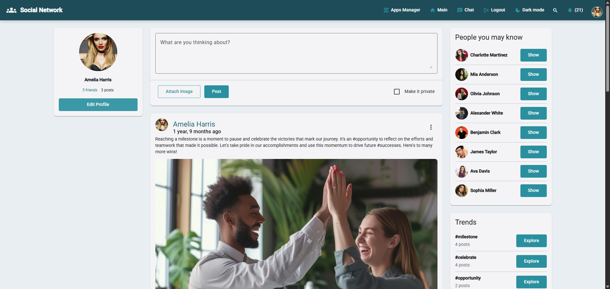

# Social Network DRF (Angular)

Social platform: posts feed, profiles, friends, real-time chat and notifications over WebSockets. Angular Material UI with signal stores.

### Live Demo: <https://angular.karnaukh-webdev.com/social/home>



## Table of Contents

- [Key Features](#key-features)
- [Pages and Routes](#pages-and-routes)
- [Architecture](#architecture)
- [State Management](#state-management)
- [API Endpoints](#api-endpoints)
- [WebSocket Integration](#websocket-integration)
- [Authentication](#authentication)
- [Backend](#backend)

## Key Features

- **Posts feed** — Infinite scroll home feed; create post with images.
- **Post detail** — Single post, comments, likes, report/delete.
- **Profiles** — View/edit profile, avatar upload, friend actions.
- **Friends** — Requests, accept/reject, friends list, suggestions sidebar.
- **Real-time chat** — Conversation list + WebSocket messages.
- **Notifications** — List + navbar badge; notification WebSocket on login.
- **Trends & search** — Hashtag trends; combined user/post search.
- **JWT auth** — Social token endpoint; encrypted profile in `localStorage`.

## Pages and Routes

| Route | Component | Auth | Description |
| ----- | --------- | ---- | ----------- |
| `/social/home` | `FeedHomePageComponent` | No | Feed + create post |
| `/social/profile/:slug` | `ProfilePageComponent` | No | Profile + user posts |
| `/social/profile/edit` | `EditProfilePageComponent` | Yes | Edit profile |
| `/social/profile/:slug/friends` | `FriendsPageComponent` | Yes | Friends + requests |
| `/social/:id` | `PostDetailPageComponent` | No | Post + comments |
| `/social/trends/:id` | `TrendPageComponent` | No | Posts by hashtag |
| `/social/chat` | `ChatPageComponent` | Yes | Messaging |
| `/social/notifications` | `NotificationsPageComponent` | Yes | Unread notifications |
| `/social/search` | `SocialSearchPageComponent` | No | Search users/posts |
| `/social/login` | `SocialLoginPageComponent` | No | Login |
| `/social/signup` | `SocialSignupPageComponent` | No | Signup |
| `/social/edit/password` | `EditPasswordPageComponent` | Yes | Change password |

Protected routes: `canActivate: [authGuard]` + `data: { authJWT: true }`.

Layout: `MainSocialLayoutComponent` (navbar, footer, notification WS init when authenticated).

## Architecture

```
src/app/features/social/
├── README.md
├── angular_social.jpg
├── social.routes.ts
├── social-theme.scss
├── components/
│   ├── social-navbar/
│   └── social-footer/
├── posts/
│   ├── data-access/social-posts.*
│   ├── components/                 # post-card, create-post-form, trends, page-layout
│   └── pages/                      # feed, post detail, search, trend
├── profiles/
│   ├── data-access/social-profile.*
│   ├── components/people-you-may-know/
│   └── pages/                      # profile, friends, edit*, login, signup
├── chat/
│   ├── data-access/social-chat.*, social-chat-websocket.service.ts
│   └── pages/chat-page/
├── notifications/
│   ├── data-access/social-notifications.*, social-notification-websocket.service.ts
│   └── pages/notifications-page/
└── layouts/main-social-layout/
```

## State Management

| Store | Responsibility |
| ----- | -------------- |
| `SocialPostsStore` | Feed, profile posts, detail, search, trends, pagination |
| `SocialProfileStore` | Current user, friends, requests, suggestions, encrypted cache |
| `SocialChatStore` | Conversations, active thread, send message |
| `SocialNotificationsStore` | Unread list, badge count, mark read |

WebSocket services: `SocialChatWebSocketService`, `SocialNotificationWebSocketService`.

## API Endpoints

### Posts

| Method | Endpoint |
| ------ | -------- |
| GET | `/api/social-posts/` |
| POST | `/api/social-posts/create/` |
| GET | `/api/social-posts/:id/` |
| POST | `/api/social-posts/:id/comment/` |
| POST | `/api/social-posts/:id/like/` |
| POST | `/api/social-posts/:id/report/` |
| DELETE | `/api/social-posts/:id/delete/` |
| GET | `/api/social-posts/profile/:slug/` |
| POST | `/api/social-posts/search/` |
| GET | `/api/social-posts/trends/` |
| GET | `/api/social-posts/?trend=:id` |

### Profiles

| Method | Endpoint |
| ------ | -------- |
| GET | `/api/social-profiles/me/` |
| POST | `/api/social-profiles/editprofile/` |
| POST | `/api/social-profiles/editpassword/` |
| GET | `/api/social-profiles/friends/:slug/` |
| POST | `/api/social-profiles/friends/:slug/request/` |
| POST | `/api/social-profiles/friends/:slug/:status/` |
| GET | `/api/social-profiles/friends/suggested/` |

### Chat

| Method | Endpoint |
| ------ | -------- |
| GET | `/api/social-chat/` |
| GET | `/api/social-chat/:id/` |
| POST | `/api/social-chat/:id/send/` |
| GET | `/api/social-chat/:slug/get-or-create/` |

### Notifications

| Method | Endpoint |
| ------ | -------- |
| GET | `/api/social-notifications/` |
| POST | `/api/social-notifications/read/:id/` |

## WebSocket Integration

### Chat

- **URL:** `ws(s)://<remoteHost>/ws/social-chat/<conversationId>/<userId>/`
- Connect when selecting a conversation; disconnect on switch or leave route.

### Notifications

- **URL:** `ws(s)://<remoteHost>/ws/notification/<userId>/`
- Connect on login in `MainSocialLayoutComponent`; disconnect on logout.
- On message → re-fetch notifications, update navbar badge.

## Authentication

| Step | Behaviour |
| ---- | --------- |
| Signup | `POST /api/social-profiles/register/` |
| Login | `POST /api/social-profiles/api/v1/token/` |
| Guards | Protected routes → `/social/login?message=auth` |
| Profile cache | CryptoJS AES in `localStorage` (`environment.encryptionKey`) |
| Logout | Clears tokens, profile, notification WebSocket |

## Backend

[Social Network Backend (Django DRF)](https://karnaukh-webdev.com/category/django/social-network-drf/)
